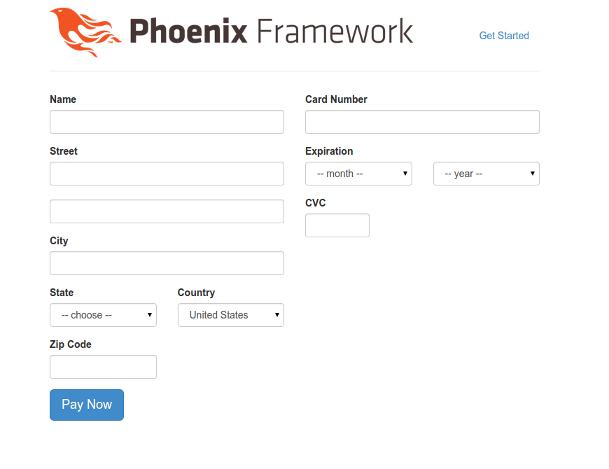
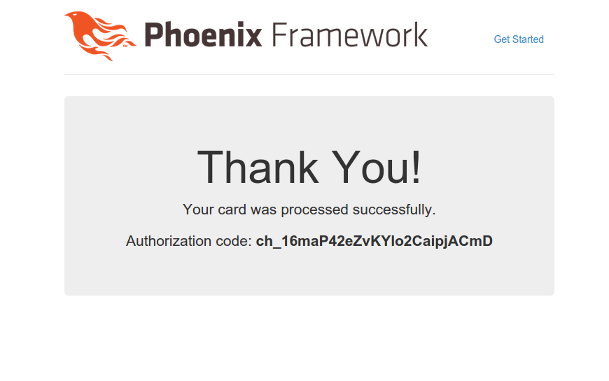

# Demo of Phoenix + Commerce.Billing

To start your Phoenix app:

  1. Install dependencies with `mix deps.get`
  2. Start Phoenix endpoint with `mix phoenix.server`
  3. Visit [`localhost:4000`](http://localhost:4000) in your browser.
  4. Click "Go to Checkout" button
  5. Fill out form
  6. Submit

The app is configured with Stripe in test mode.

Use card number **4111111111111111** or any test Stripe card

## Screenshots

### Checkout Page

### Thank you Page

## Learn more

### Commerce.Billing

  * https://github.com/joshnuss/commerce_billing

### Phoenix

  * Official website: http://www.phoenixframework.org/
  * Guides: http://phoenixframework.org/docs/overview
  * Docs: http://hexdocs.pm/phoenix
  * Mailing list: http://groups.google.com/group/phoenix-talk
  * Source: https://github.com/phoenixframework/phoenix

## License

MIT

This project was created by Joshua Nussbaum, a software consultant specializing in API integrations. You can reach me at josh _at_ centera.co
